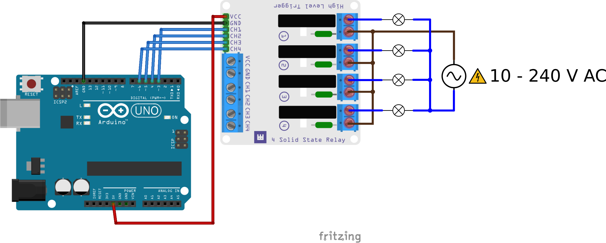

# WPM463 2 channel Solid State Relay module

This example will repeatedly turn both SSR channels on and off.

## Library dependencies
* None

## Wiring diagram

## Additional information
  For more information about the Whadda WPM463 2 channel Solid State Relay module, check the manual available at [whadda.com](https://whadda.com)